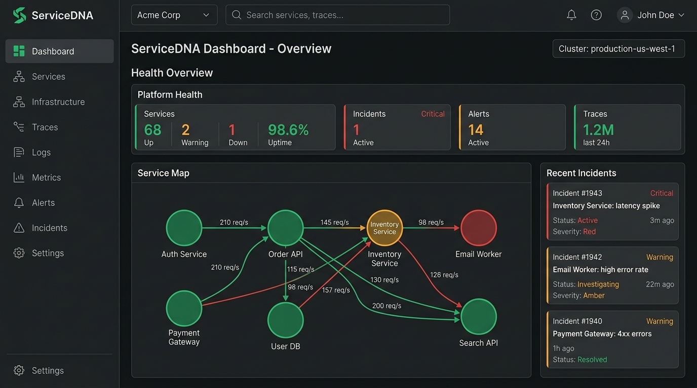

<div align="center">



# 🧬 ServiceDNA

**The open-source service health, dependency, and incident management platform.**

[](https://openjdk.org/)
[](https://spring.io/projects/spring-boot)
[](https://react.dev/)
[](https://www.typescriptlang.org/)
[](https://www.postgresql.org/)
[](https://kafka.apache.org/)
[](LICENSE)

[Features](#-features) · [Architecture](#-architecture) · [Quick Start](#-quick-start) · [API Docs](API.md) · [Contributing](CONTRIBUTING.md) · [Changelog](CHANGELOG.md)

</div>

---

## 🚀 What is ServiceDNA?

ServiceDNA is a full-stack platform that gives engineering teams **complete visibility** into their distributed services. Register your microservices, monitor their health with automated checks, visualize inter-service dependencies as an interactive graph, and manage incidents end-to-end — from detection, through on-call paging and escalation, to a published post-mortem — all from a single, real-time dashboard.

Think of it as a self-hosted blend of **Datadog's Service Map**, **PagerDuty's Incident Management**, and **Atlassian Statuspage** — built with a modern stack, run on infrastructure you control, with no per-seat pricing.

---

## ✨ Features

<table>
<tr>
<td width="50%">

### 📊 Real-Time Dashboard
Live health overview of all services with instant WebSocket updates. No refresh needed — metrics stream directly to your browser via STOMP over SockJS.

### 🔗 Interactive Dependency Graph
Visualize service-to-service relationships with an auto-layouted directed graph. Click any node to explore blast radius and upstream/downstream dependencies.

### 🚨 Incident Management
Full lifecycle from detection to resolution: manual or alert-triggered creation, status transitions, acknowledgement, a structured post-mortem (root cause / timeline / action items), and an auto-built event timeline — no manual logging required.

### 📟 On-Call & Escalation
Configure a rotating on-call schedule per organization, view it as a color-coded monthly calendar, and set an escalation policy that pages a fallback contact if a critical incident goes unacknowledged.

</td>
<td width="50%">

### 🔔 Alerts & Notification Webhooks
Define per-service alert rules (latency, error rate, consecutive failures) that automatically open incidents, and route incident created/resolved/escalated events to Slack, Microsoft Teams, or any generic JSON webhook.

### 📈 SLA & Error Budgets
Set a per-service uptime SLO target and track its error budget — total allowed downtime, how much is consumed, and the burn-down — over 7/30/90-day windows, alongside uptime, MTTR, and MTBF.

### 🌐 Public Status Page
Share a read-only, unauthenticated status page (`/status/:orgId`) with your customers. Auto-refreshes with live service health and active incidents.

### 💳 Stripe Billing Integration
Built-in subscription management with Free, Pro, and Enterprise tiers — checkout sessions, plan upgrades, and a billing portal, all wired through Stripe's API.

</td>
</tr>
</table>

### And also...

- 🔐 **GitHub OAuth2 + Generic OIDC SSO** — passwordless login via rotating JWT access/refresh tokens, with provider-verified-email checks on account linking
- 🏢 **Multi-Organization Support** — isolated tenants, role-based member management (Owner/Admin/Member/Viewer), and email invites
- 📜 **Audit Log** — every sensitive action (role changes, service edits, deletions) recorded per organization and searchable in Settings
- 🗂️ **Bulk Operations** — CSV import/export for services, multi-select bulk status changes for incidents
- 🔑 **Programmatic Ingestion** — per-service API keys for health-check reporting, with Redis-backed rate limiting on every API route
- 🗃️ **Data Portability** — self-service JSON data export and account deletion (soft-deleted/anonymized in place so incident history and audits stay intact)
- ⌨️ **Command Palette** (`Ctrl+K`) — fuzzy search across services and incidents, plus inline quick actions (acknowledge/resolve an incident without leaving the palette)
- 📱 **Mobile-Responsive UI** — an off-canvas navigation drawer and responsive layouts across incidents, on-call, and settings
- 🧪 **E2E Testing** — Playwright test suite for critical navigation paths
- 📡 **Event-Driven Architecture** — Kafka-powered async processing for health checks, alerts, and telemetry

---

## 🏗 Architecture

```
┌─────────────────────────────────────────────────────────┐
│                    FRONTEND (React SPA)                 │
│  Vite · TypeScript · Tailwind · TanStack Query · Zustand│
│  React Flow · cmdk · STOMP/SockJS · Playwright          │
└────────────────────────┬────────────────────────────────┘
                         │ REST + WebSocket
┌────────────────────────▼────────────────────────────────┐
│                 BACKEND (Spring Boot 3.x)               │
│                                                         │
│ ┌────────┐┌─────────┐┌──────────┐┌────────┐┌──────────┐│
│ │  Auth  ││ Service ││ Incident ││On-Call ││Escalation││
│ │ (OIDC) ││Registry ││ Manager  ││        ││          ││
│ └────────┘└─────────┘└──────────┘└────────┘└──────────┘│
│ ┌────────┐┌─────────┐┌──────────┐┌────────┐┌──────────┐│
│ │ Alert  ││Dashboard││Telemetry ││ Org &  ││ Webhook  ││
│ │ Engine ││  & WS   ││  Ingest  ││Members ││(Slack/MS)││
│ └────────┘└─────────┘└──────────┘└────────┘└──────────┘│
│ ┌────────┐┌─────────┐                                   │
│ │Billing ││Analytics│                                   │
│ │(Stripe)││ (SLA)   │                                   │
│ └────────┘└─────────┘                                   │
└───┬──────────────┬──────────────┬───────────────┬───────┘
    │              │              │               │
┌───▼────┐   ┌─────▼─────┐  ┌────▼────┐   ┌──────▼──────┐
│Postgres│   │   Redis   │  │  Kafka  │   │   Zipkin    │
│  (DB)  │   │Cache/Rate │  │ (Events)│   │ (Tracing)   │
│        │   │  Limit    │  │         │   │             │
└────────┘   └───────────┘  └─────────┘   └─────────────┘
```

### Backend Modules

| Module | Description |
|--------|-------------|
| `auth` | GitHub OAuth2 + generic OIDC login, JWT + refresh token issuance |
| `user` | Account settings: password/email change, notification preferences, data export, account deletion |
| `organization` | Multi-tenant org management, members, invites, role-based access, audit log |
| `service` | Service registry, health checks, dependency graph, maintenance windows, public status |
| `incident` | Incident CRUD, status transitions, acknowledgement, post-mortems, auto-built event timeline |
| `oncall` | Rotating on-call schedule configuration and current-on-call lookup |
| `escalation` | Escalation policy config and the scheduled job that pages unacknowledged incidents |
| `webhook` | Org-level Slack/Teams/generic notification webhooks for incident events |
| `alert` | Alert rule configuration, Kafka consumer for threshold evaluation |
| `analytics` | SLA report generation: uptime, MTTR, MTBF, and per-service error budgets |
| `dashboard` | Aggregated summary, WebSocket broadcast via STOMP |
| `billing` | Stripe subscriptions, checkout sessions, webhook handler |
| `telemetry` | Health-check ingestion (API-key authenticated), ping retention |
| `common` | Shared config: CORS, WebSocket, caching, rate limiting, exception handling |

### Frontend Stack

| Layer | Technology |
|-------|-----------|
| Framework | React 19 + TypeScript 6 |
| Build | Vite 8 |
| Styling | Tailwind CSS 4 (dark-first charcoal theme) |
| Server State | TanStack Query (caching, background refetch, optimistic updates) |
| Client State | Zustand (auth, org selection, UI) |
| Real-Time | STOMP over SockJS → TanStack Query cache invalidation |
| Graph | React Flow + dagre auto-layout |
| Charts | Recharts (latency/uptime, SLA burn-down) |
| Command Palette | cmdk |
| Testing | Playwright (Chromium) |

See [ARCHITECTURE.md](ARCHITECTURE.md) for the full request-flow and module breakdown, and [API.md](API.md) for the complete endpoint reference.

---

## ⚡ Quick Start

### Prerequisites

- **Java 21** (JDK)
- **Node.js 20+** & npm
- **Docker** & Docker Compose
- A [GitHub OAuth App](https://github.com/settings/developers) (for authentication)

### 1. Clone the Repository

```bash
git clone https://github.com/varuns2903/servicedna.git
cd servicedna
```

### 2. Start Infrastructure

```bash
docker-compose up -d
```

This starts **PostgreSQL**, **Redis**, **Kafka** (with Zookeeper), and **Zipkin**.

### 3. Configure the Backend

```bash
cp backend/.env.example backend/.env
```

Edit `backend/.env` and fill in your:
- `GITHUB_CLIENT_ID` and `GITHUB_CLIENT_SECRET` — from your GitHub OAuth App
- `JWT_SECRET` — any strong 256-bit random string
- `STRIPE_API_KEY` — your Stripe test secret key (optional)
- `OIDC_ISSUER_URI` — a generic OIDC provider's issuer URL, if you want SSO beyond GitHub (optional)

### 4. Start the Backend

```bash
cd backend
./mvnw spring-boot:run
```

The API will be available at `http://localhost:8080`. Flyway applies all migrations automatically on startup.

### 5. Start the Frontend

```bash
cd frontend
npm install
npm run dev
```

The app will be available at `http://localhost:5173`.

### 6. Run E2E Tests (Optional)

```bash
cd frontend
npx playwright install chromium
npm run test:e2e
```

---

## 🐳 Run Everything with Docker

Prefer not to install Java or Node locally? `docker-compose.yml` also builds and runs the backend
and frontend themselves, not just the infrastructure:

```bash
cp backend/.env.example .env   # fill in JWT_SECRET at minimum
docker-compose up -d --build
```

This builds and starts **everything** — Postgres, Redis, Kafka, Zipkin, the Spring Boot API, and
the frontend served by nginx. The app is available at `http://localhost:5173` and the API at
`http://localhost:8080`. `JWT_SECRET` is the only variable docker-compose refuses to default —
everything else (GitHub OAuth, SSO, SMTP, Stripe) is optional and can be left unset.

To rebuild after pulling changes: `docker-compose up -d --build`. To stop everything:
`docker-compose down` (add `-v` to also drop the Postgres volume).

---

## 📁 Project Structure

```
servicedna/
├── backend/
│   ├── src/main/java/com/servicedna/
│   │   ├── alert/          # Alert rules & Kafka consumer
│   │   ├── analytics/      # SLA reports & error budgets
│   │   ├── auth/           # OAuth2/OIDC, JWT, security config
│   │   ├── billing/        # Stripe integration
│   │   ├── dashboard/      # Dashboard summary & WebSocket publisher
│   │   ├── escalation/     # Escalation policies & paging job
│   │   ├── incident/       # Incident lifecycle & event timeline
│   │   ├── oncall/         # On-call rotation
│   │   ├── organization/   # Multi-tenant org, members, audit log
│   │   ├── service/        # Service registry & health checks
│   │   ├── telemetry/      # Health-check ingestion
│   │   ├── user/           # Account settings, data export/deletion
│   │   ├── webhook/        # Slack/Teams/generic notification webhooks
│   │   └── common/         # CORS, WebSocket, caching, rate limiting
│   └── src/main/resources/
│       └── db/migration/   # Flyway migrations
├── frontend/
│   ├── src/
│   │   ├── api/            # Typed Axios API clients
│   │   ├── components/     # Design system (UI primitives, layout)
│   │   ├── features/       # Feature modules (dashboard, services, map, settings, etc.)
│   │   ├── hooks/          # TanStack Query hooks
│   │   ├── providers/      # WebSocket provider
│   │   └── stores/         # Zustand stores (auth, org, UI)
│   ├── tests/              # Playwright E2E tests
│   └── playwright.config.ts
├── docker-compose.yml      # Infra + backend + frontend containers
├── API.md                  # API reference
├── ARCHITECTURE.md         # System architecture docs
├── CONTRIBUTING.md         # Contribution guidelines
├── SECURITY.md             # Security policy
├── CHANGELOG.md            # Release history
└── LICENSE                 # MIT
```

---

## 🔑 Environment Variables

<details>
<summary><strong>Backend</strong> (<code>backend/.env</code>)</summary>

| Variable | Description | Default |
|----------|-------------|---------|
| `SPRING_DATASOURCE_URL` | PostgreSQL JDBC URL | `jdbc:postgresql://localhost:5433/servicedna` |
| `SPRING_DATASOURCE_USERNAME` | DB username | `postgres` |
| `SPRING_DATASOURCE_PASSWORD` | DB password | `postgres` |
| `SPRING_DATA_REDIS_HOST` | Redis host | `localhost` |
| `SPRING_DATA_REDIS_PORT` | Redis port | `6380` |
| `SPRING_KAFKA_BOOTSTRAP_SERVERS` | Kafka brokers | `localhost:9092` |
| `CORS_ALLOWED_ORIGINS` | Comma-separated allowed frontend origins | `http://localhost:5173,http://localhost:3000` |
| `FRONTEND_URL` | Base URL used in email links and OAuth redirects | — |
| `GITHUB_CLIENT_ID` / `GITHUB_CLIENT_SECRET` | GitHub OAuth App credentials | — |
| `OIDC_ISSUER_URI` | Generic OIDC provider issuer URL (enables SSO beyond GitHub) | — |
| `OIDC_CLIENT_ID` / `OIDC_CLIENT_SECRET` | Generic OIDC client credentials | — |
| `JWT_SECRET` | Access token signing key (256-bit min) | — |
| `JWT_EXPIRATION_MS` | Access token TTL in ms | `86400000` |
| `JWT_REFRESH_EXPIRATION_MS` | Refresh token TTL in ms | `2592000000` (30 days) |
| `SMTP_HOST` / `SMTP_PORT` / `SMTP_USERNAME` / `SMTP_PASSWORD` | Outbound mail for verification/reset/notification emails (optional — logs instead of sending if unset) | — |
| `MAIL_FROM` | From-address for outbound email | — |
| `STRIPE_API_KEY` / `STRIPE_WEBHOOK_SECRET` | Stripe secret key and webhook signing secret | — |
| `STRIPE_PRO_PRICE_ID` / `STRIPE_ENTERPRISE_PRICE_ID` | Stripe Price IDs for paid tiers | — |
| `PING_RETENTION_DAYS` | Days of health-check ping history kept before pruning | `90` |
| `PING_RETENTION_CRON` | Cron schedule for the ping-retention cleanup job | `0 0 3 * * *` |
| `ESCALATION_CHECK_CRON` | Cron schedule for the unacknowledged-incident escalation job | `0 */5 * * * *` |
| `RATE_LIMIT_MAX_REQUESTS` | Max API requests per client per minute | `100` |
| `HEALTH_CHECK_INTERVAL_MS` | Interval between automated health-check probes | `30000` |
| `HEALTH_CHECK_TIMEOUT_MS` | Per-probe HTTP timeout | `5000` |
| `MANAGEMENT_ZIPKIN_TRACING_ENDPOINT` | Zipkin span export endpoint | `http://localhost:9411/api/v2/spans` |
| `DATADOG_ENABLED` / `DATADOG_API_KEY` | Optional Datadog metrics export | `false` / — |
| `NEW_RELIC_ENABLED` / `NEW_RELIC_API_KEY` / `NEW_RELIC_ACCOUNT_ID` | Optional New Relic metrics export | `false` / — / — |

</details>

<details>
<summary><strong>Frontend</strong> (<code>frontend/.env</code>)</summary>

| Variable | Description | Default |
|----------|-------------|---------|
| `VITE_API_URL` | Backend API base URL | `http://localhost:8080/api/v1` |
| `VITE_AUTH_LOGIN_URL` | GitHub OAuth2 authorization endpoint | `http://localhost:8080/oauth2/authorization/github` |
| `VITE_SSO_LOGIN_URL` | Generic OIDC authorization endpoint (shown only when the backend reports SSO enabled) | `http://localhost:8080/oauth2/authorization/oidc` |

There's no separate WebSocket URL variable — the STOMP/SockJS endpoint is derived from `VITE_API_URL` by replacing its `/api/v1` suffix with `/ws`.

</details>

---

## 🤝 Contributing

We welcome contributions! Please read our [Contributing Guide](CONTRIBUTING.md) for details on the development workflow, coding standards, and how to submit pull requests.

## 🔒 Security

If you discover a security vulnerability, please report it responsibly. See our [Security Policy](SECURITY.md) for details.

## 📄 License

This project is licensed under the MIT License — see the [LICENSE](LICENSE) file for details.

---

<div align="center">

Built with ☕ and 🧬 by [varuns2903](https://github.com/varuns2903)

</div>
